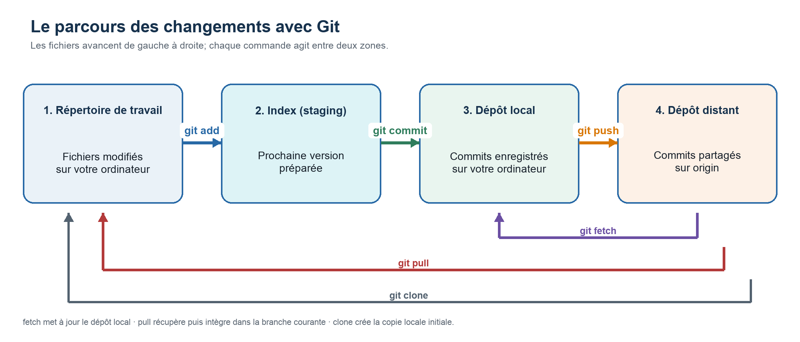

# Git — commandes essentielles

Guide pratique avec exemples rapides et schéma du flux `add → commit → push`.

> **À retenir :** Git enregistre des instantanés de votre projet. La plupart du temps : modifier → ajouter à l’index → créer un commit → partager.

## 1. Configuration initiale

```bash
# Affiche la version de Git
git --version

# Configurez votre identité pour les commits
git config --global user.name "Ada Lovelace"
git config --global user.email "ada.lovelace@example.com"

# Configurez la politique de pull : fusion par défaut, avance rapide si possible
git config --global pull.rebase false
git config --global pull.ff true

# Affiche la configuration actuelle
git config --list
```

## 2. Démarrer ou récupérer un dépôt

- `git init` — crée un dépôt dans le dossier courant.
- `git clone URL` — copie un dépôt distant et son historique.
- `git status` — montre les fichiers modifiés, indexés ou non suivis.

```bash
mkdir demo && cd demo
git init
git clone https://github.com/org/projet.git
git status
```

## 3. Préparer et enregistrer les changements

- `git add fichier` — ajoute un fichier à l’index, par exemple `git add README.md`.
- `git add repertoire/` — ajoute le contenu d’un répertoire, par exemple `git add src/`.
- `git add .` — ajoute les changements du dossier courant.
- `git commit -m "message"` — crée un commit à partir de l’index.
- `git diff` — montre les changements non indexés.
- `git diff --staged` — montre ce qui sera inclus au prochain commit.

## 4. Schéma : flux aller et retour



> Le commit est d’abord créé dans le dépôt local, puis `push` l’envoie vers le dépôt distant. En sens inverse, `fetch` met à jour le dépôt local, `pull` récupère et intègre dans la branche courante, et `clone` crée la copie locale initiale.

```bash
echo "# Mon projet" > README.md
git add README.md
git commit -m "Ajoute le README"
git push -u origin main
```

## 5. Synchroniser avec un dépôt distant

Après avoir configuré le suivi de la branche une première fois, les versions courtes suffisent généralement.

- `git fetch` — télécharge références et commits sans modifier votre branche.
- `git pull` — récupère puis intègre les changements distants.
- `git push` — envoie vos commits vers le dépôt distant.
- `git push -u origin branche` — premier envoi : publie une branche et définit son suivi.
- `git remote -v` — affiche les dépôts distants.
- `git remote add origin URL` — ajoute un dépôt distant nommé `origin`.

```bash
# Usage quotidien, après configuration du suivi
git fetch
git pull
git push

# Nécessaire au premier envoi d’une nouvelle branche
git push -u origin main

git remote -v
git remote add origin https://github.com/org/projet.git
```

### Politique de pull recommandée

Un `git pull` exécute essentiellement un `fetch`, puis intègre les changements. Pour utiliser une fusion plutôt qu’un rebase, avec avance rapide lorsque possible :

```bash
git config --global pull.rebase false
git config --global pull.ff true
```

Git fait une avance rapide si possible; si les historiques ont divergé, il crée un commit de fusion. Pour refuser toute fusion automatique en cas de divergence, utilisez plutôt `git config --global pull.ff only`.

## 6. Travailler avec les branches

- `git branch` — liste les branches locales.
- `git branch nom` — crée une branche sans s’y déplacer.
- `git switch nom` — change de branche.
- `git switch -c nom` — crée une branche et s’y déplace.
- `git merge branche` — fusionne une branche dans la branche courante.
- `git branch -d nom` — supprime une branche locale déjà fusionnée.

```bash
git switch -c correction-menu
# Modifier les fichiers, puis commit...
git switch main
git merge correction-menu
git branch -d correction-menu
```

## 7. Consulter l’historique

```bash
git log
git log --oneline
git log --oneline --graph --all
git show a1b2c3d
```

## 8. Retirer des éléments de l’index

Ces commandes **n’effacent pas les fichiers locaux**. Elles retirent seulement les changements de la prochaine validation.

```bash
# Un fichier
git restore --staged README.md

# Un répertoire
git restore --staged src/

# Tout le dossier courant
git restore --staged .

# Ancienne syntaxe compatible
git reset HEAD -- README.md
git reset HEAD -- src/
```

## 9. Annuler des modifications locales

> **Attention :** `git restore` remplace les modifications non validées par la version du dernier commit. Le travail local visé est perdu.

```bash
# Un fichier suivi
git restore README.md

# Tous les fichiers suivis d’un répertoire
git restore src/

# Tous les fichiers suivis du dossier courant
git restore .

# Prévisualiser, puis supprimer les fichiers et répertoires non suivis
git clean -n
git clean -fd
```

Pour retirer un fichier de l’index **et** annuler sa modification locale :

```bash
git restore --staged --worktree README.md
```

Cette dernière commande entraîne la perte du changement local.

## 10. Autres commandes utiles

- `git rm fichier` — supprime un fichier et indexe la suppression.
- `git mv ancien nouveau` — déplace ou renomme et indexe le changement.
- `git stash` — met temporairement de côté les changements suivis.
- `git stash pop` — réapplique le dernier stash et le retire de la liste.
- `git tag v1.0.0` — crée une étiquette légère sur le commit courant.

## 11. Mini-scénarios

### Créer un dépôt local

```bash
mkdir mon-projet && cd mon-projet
git init
echo "# Mon projet" > README.md
git add README.md
git commit -m "Premier commit"
```

### Travailler sur une fonctionnalité

```bash
git switch -c ajout-contact
# Modifier les fichiers...
git add .
git commit -m "Ajoute le formulaire de contact"
git switch main
git merge ajout-contact
```

### Mettre son dépôt à jour avant de pousser

```bash
git pull
git push
```

## 12. Aide-mémoire quotidien

1. `git status` — comprendre la situation avant d’agir.
2. `git diff` — relire les modifications non indexées.
3. `git add <chemin>` — choisir ce qui entrera dans le commit.
4. `git diff --staged` — vérifier le prochain commit.
5. `git commit -m "message clair"` — enregistrer localement.
6. `git pull` — intégrer les changements distants.
7. `git push` — partager ses commits.

**Conseil :** faites des commits petits, cohérents et accompagnés d’un message qui décrit le changement.
