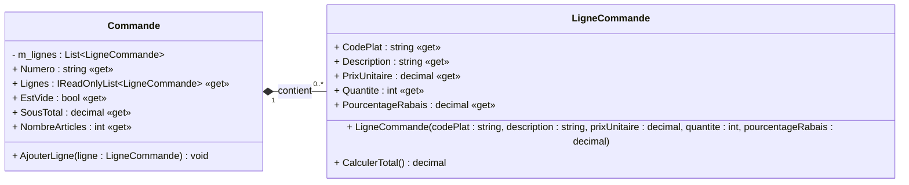

# E03 — Tester sans dépendance

## Récit utilisateur

> En tant que caissière, je veux obtenir le sous-total net et le nombre
> d'articles d'une commande afin d'annoncer un montant exact au client, même
> lorsqu'une ligne bénéficie d'un rabais.

### Critères d'acceptation

- **Étant donné** deux poutines à 14,50 $ avec un rabais de 10 % et une soupe
  à 6,00 $ sans rabais;
- **lorsque** les totaux sont calculés;
- **alors** le sous-total net vaut 32,10 $ et le nombre d'articles vaut 3;
- le rabais d'une ligne est fixé à sa création et ne peut plus être modifié;
- les données invalides sont refusées par une exception précise.

Le lien avec AAA est direct : **Étant donné = Arranger**, **Lorsque = Agir** et
**Alors = Auditer**.

**Livrable :** les tests de `LigneCommande` et `Commande`, sans doublure.

**Première action :** ouvrez la
[solution fournie](./S02E03E05_Restaurant_Commande/) et exécutez `dotnet test`
pour vérifier qu'elle compile avant vos changements.

## Modèle utile maintenant



## 1. Premier test AAA

Créez `LigneCommandeTests.cs`. Construisez une ligne sans rabais en passant
explicitement `0m`, puis vérifiez que deux plats à 14,50 $ produisent exactement
`29.00m`.

- Nommez le test selon `Methode_Cas_ResultatAttendu`.
- Séparez Arranger, Agir et Auditer.
- Utilisez `Assert.Equal`, pas une condition vague comme `total > 0`.

## 2. Tests paramétrés

Utilisez une théorie pour vérifier que `CalculerTotal()` produit toujours le
montant net. Combinez le prix, la quantité, le rabais et le total attendu.

| Prix | Quantité | Rabais | Total net attendu |
|---:|---:|---:|---:|
| 10,00 $ | 1 | 0 % | 10,00 $ |
| 12,50 $ | 2 | 10 % | 22,50 $ |
| 3,25 $ | 4 | 20 % | 10,40 $ |
| 10,00 $ | 2 | 100 % | 0,00 $ |

Les cas à 0 % et à 100 % vérifient explicitement les deux limites permises.

> [!TIP]
> Les attributs acceptent seulement des constantes. Vous pouvez convertir des
> `double` reçus par `InlineData` en `decimal`, ou utiliser `MemberData` pour
> fournir directement des valeurs `decimal`.

## 3. Valider `LigneCommande`

Dans `LigneCommandeTests.cs`, vérifiez les refus suivants :

- code de plat vide;
- description vide;
- prix unitaire négatif;
- quantité égale à zéro;
- rabais inférieur à 0 % ou supérieur à 100 %.

Utilisez `Assert.Throws<T>()`. Pour chaque `ArgumentOutOfRangeException`,
vérifiez également `ParamName`.

## 4. Tester `Commande`

Créez `CommandeTests.cs`, puis vérifiez :

- une commande vide : `EstVide`, sous-total `0m`, zéro article;
- le scénario du récit : la ligne avec rabais produit automatiquement un
  sous-total net de `32.10m` et la commande contient trois articles;
- numéro de commande vide;
- ajout d'une ligne `null`.

Pour les deux refus, vérifiez le type précis de l'exception et `ParamName`.

<details>
<summary>Besoin d'aide dans les notes?</summary>

Consultez le chapitre 9, sections **Structure AAA**, **Nom des tests** et
**Bonnes propriétés : FIRST**, puis le chapitre 7 pour `throw` et les familles
d'exceptions.

</details>

## Terminé lorsque

- [ ] les cas normaux, limites et invalides sont couverts;
- [ ] chaque théorie porte sur une seule règle;
- [ ] les tests d'exceptions sont terminés et AAA est uniforme;
- [ ] aucun mock ou objet substitut n'est utilisé;
- [ ] tous les tests réussissent.

```bash
dotnet test
git add .
git status
git commit -m "E03 - Ajoute les tests sans dépendance"
git push
```

Passez ensuite à [E04 — Simulacre manuel](./E04-simulacre-manuel.md).
