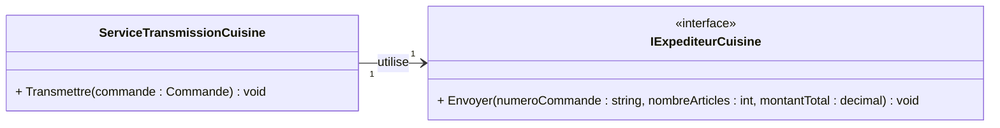

# E04 — Créer un simulacre à la main

## Récit utilisateur

> En tant que responsable de cuisine, je veux recevoir une commande valide une
> seule fois avec ses informations exactes afin de préparer les bons plats.

### Critères d'acceptation

- **Étant donné** la commande `C-1042` contenant trois articles sans rabais
  pour 35,00 $;
- **lorsque** elle est transmise;
- **alors** la cuisine reçoit une fois son numéro, sa quantité et son montant;
- une commande vide ou `null` n'est jamais envoyée.

**Livrable :** deux simulacres manuels spécialisés selon l'interaction attendue.

**Première action :** lisez `IExpediteurCuisine.cs` et
`ServiceTransmissionCuisine.cs`, puis notez les quatre attentes observables.

## Modèle utile maintenant



`Transmettre()` refuse une commande `null` ou vide. Pour une commande valide,
il appelle `Envoyer()` exactement une fois avec les trois valeurs calculées.

## 1. Construire les simulacres

Créez deux classes dans `S02E03E05_Restaurant_Commande.Tests`, sans utiliser
Moq.

`ExpediteurCuisineSimulacreUnEnvoi` doit :

- implanter `IExpediteurCuisine`;
- recevoir les trois valeurs attendues au constructeur;
- conserver ces attentes dans des variables d'objet privées préfixées `m_`;
- enregistrer le nombre d'appels et les trois valeurs du dernier appel dans
  `Envoyer()`, sans y faire de vérification;
- fournir `VerifierAttentes()` pour vérifier un appel exact et les trois
  paramètres reçus.

`ExpediteurCuisineSimulacreAucunEnvoi` doit :

- implanter `IExpediteurCuisine`;
- incrémenter uniquement un compteur dans `Envoyer()`;
- fournir `VerifierAttentes()` pour vérifier que le nombre d'appels attendu est
  bien zéro.

<details>
<summary>Afficher le squelette proposé - Ne pas afficher tout de suite - Réfléchir avant de cliquer</summary>

```csharp
public sealed class ExpediteurCuisineSimulacreUnEnvoi : IExpediteurCuisine
{
    public ExpediteurCuisineSimulacreUnEnvoi(
        string numeroAttendu,
        int nombreArticlesAttendu,
        decimal montantAttendu)
    {
        // Conserver les attentes.
    }

    public void Envoyer(
        string numeroCommande,
        int nombreArticles,
        decimal montantTotal)
    {
        // Enregistrer l'appel et ses paramètres.
    }

    public void VerifierAttentes()
    {
        // Vérifier l'appel unique et ses paramètres.
    }
}

public sealed class ExpediteurCuisineSimulacreAucunEnvoi
    : IExpediteurCuisine
{
    public void Envoyer(
        string numeroCommande,
        int nombreArticles,
        decimal montantTotal)
    {
        // Enregistrer l'appel.
    }

    public void VerifierAttentes()
    {
        // Vérifier que le nombre d'appels est zéro.
    }
}
```

</details>

> [!IMPORTANT]
> `Envoyer()` appartient à la partie Agir : il enregistre l'interaction sans
> faire échouer le test. Appelez toujours `VerifierAttentes()` dans la partie
> Auditer pour comparer les appels reçus aux attentes.

Ces deux classes montrent qu'un simulacre manuel est souvent spécialisé pour
un cas d'interaction. Dans l'exercice suivant, Moq permettra d'exprimer ces
attentes directement dans chaque test sans multiplier les classes.

## 2. Vérifier la transmission valide

Créez `ServiceTransmissionCuisineTests.cs`. Les trois scénarios de cet exercice
seront écrits dans ce fichier.

Construisez `C-1042` avec deux poutines à 14,50 $ et une soupe à 6,00 $.
Passez explicitement `0m` comme pourcentage de rabais à chacune des lignes.
Injectez `ExpediteurCuisineSimulacreUnEnvoi` dans le service et vérifiez :

- numéro `C-1042`;
- trois articles;
- montant `35.00m`;
- exactement un appel.

## 3. Vérifier les deux refus

Écrivez un test pour une commande vide et un autre pour une commande `null`.
Dans les deux cas :

- utilisez `ExpediteurCuisineSimulacreAucunEnvoi`;
- vérifiez l'exception précise;
- appelez ensuite `VerifierAttentes()`.

<details>
<summary>Besoin d'aide dans les notes?</summary>

Consultez le chapitre 9, sections **Doublures de test** et **Quand utiliser une
doublure ou un simulacre**.

</details>

## Terminé lorsque

- [ ] un mauvais paramètre fait échouer le test valide;
- [ ] zéro ou deux appels échouent lorsqu'un appel est attendu;
- [ ] les refus vérifient l'exception et l'absence d'appel;
- [ ] aucune vérification n'est effectuée pendant la partie Agir;
- [ ] chaque simulacre représente clairement son cas d'interaction;
- [ ] un échec a été provoqué volontairement, puis le code correct a été
  remis;
- [ ] aucun paquet de doublures n'est installé.

```bash
dotnet test
git add .
git status
git commit -m "E04 - Ajoute le simulacre manuel de cuisine"
git push
```

Passez ensuite à [E05 — Moq](./E05-moq.md).
