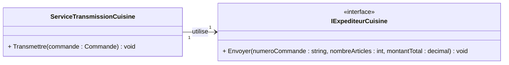

# E04 — Créer un simulacre à la main

## Récit utilisateur

> En tant que responsable de cuisine, je veux recevoir une commande valide une
> seule fois avec ses informations exactes afin de préparer les bons plats.

### Critères d'acceptation

- **Étant donné** la commande `C-1042` contenant trois articles sans rabais
  pour 35,00 $;
- **lorsque** elle est transmise;
- **alors** la cuisine reçoit une fois son numéro, sa quantité et son montant;
- une commande vide ou `null` n'est jamais envoyée.

**Livrable :** un simulacre manuel réutilisé par trois tests.

**Première action :** lisez `IExpediteurCuisine.cs` et
`ServiceTransmissionCuisine.cs`, puis notez les quatre attentes observables.

## Modèle utile maintenant



`Transmettre()` refuse une commande `null` ou vide. Pour une commande valide,
il appelle `Envoyer()` exactement une fois avec les trois valeurs calculées.

## 1. Construire le simulacre

Créez `ExpediteurCuisineSimulacre.cs` dans
`S02E03E05_Restaurant_Commande.Tests`. Sans utiliser Moq, la classe doit :

- implanter `IExpediteurCuisine`;
- recevoir les trois valeurs et le nombre d'appels attendus au constructeur;
- conserver ces attentes dans des variables d'objet privées préfixées `m_`;
- incrémenter un compteur dans `Envoyer()`;
- vérifier immédiatement les trois paramètres reçus;
- fournir `VerifierAttentes()` pour vérifier le nombre exact d'appels.

<details>
<summary>Afficher le squelette proposé - Ne pas afficher tout de suite - Réfléchir avant de cliquer</summary>

```csharp
public sealed class ExpediteurCuisineSimulacre : IExpediteurCuisine
{
    public ExpediteurCuisineSimulacre(
        string numeroAttendu,
        int nombreArticlesAttendu,
        decimal montantAttendu,
        int nombreAppelsAttendu)
    {
        // Conserver les attentes.
    }

    public void Envoyer(
        string numeroCommande,
        int nombreArticles,
        decimal montantTotal)
    {
        // Enregistrer l'appel et vérifier les paramètres.
    }

    public void VerifierAttentes()
    {
        // Vérifier le nombre exact d'appels.
    }
}
```

</details>

> [!IMPORTANT]
> Les assertions dans `Envoyer()` ne détectent pas un appel absent. Appelez
> toujours `VerifierAttentes()` dans la partie Auditer du test.

## 2. Vérifier la transmission valide

Construisez `C-1042` avec deux poutines à 14,50 $ et une soupe à 6,00 $.
Passez explicitement `0m` comme pourcentage de rabais à chacune des lignes.
Injectez le simulacre dans le service et vérifiez :

- numéro `C-1042`;
- trois articles;
- montant `35.00m`;
- exactement un appel.

## 3. Vérifier les deux refus

Écrivez un test pour une commande vide et un autre pour une commande `null`.
Dans les deux cas :

- attendez zéro appel;
- vérifiez l'exception précise;
- appelez ensuite `VerifierAttentes()`.

<details>
<summary>Besoin d'aide dans les notes?</summary>

Consultez le chapitre 9, sections **Doublures de test** et **Quand utiliser une
doublure ou un simulacre**.

</details>

## Terminé lorsque

- [ ] un mauvais paramètre fait échouer le test valide;
- [ ] zéro ou deux appels échouent lorsqu'un appel est attendu;
- [ ] les refus vérifient l'exception et l'absence d'appel;
- [ ] un échec a été provoqué volontairement, puis le code correct a été
  remis;
- [ ] aucun paquet de doublures n'est installé.

```bash
dotnet test
git add .
git status
git commit -m "E04 - Ajoute le simulacre manuel de cuisine"
git push
```

Passez ensuite à [E05 — Moq](./E05-moq.md).
