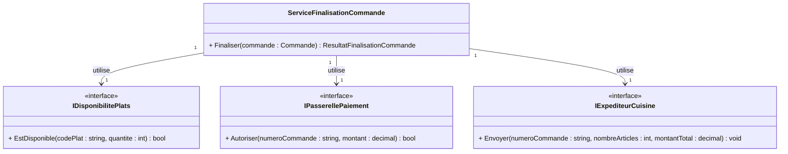

# E05 — Tester un cas intégrateur avec Moq

## Récit utilisateur

> En tant que responsable du restaurant, je veux envoyer une commande en
> cuisine seulement si les plats sont disponibles et le paiement accepté afin
> d'éviter une préparation inutile.

### Critères d'acceptation

- chaque plat est vérifié dans l'ordre;
- le premier plat indisponible arrête la finalisation;
- le paiement est demandé seulement si tous les plats sont disponibles;
- la cuisine reçoit la commande seulement après un paiement accepté.

**Livrable :** les tests Moq de `ServiceFinalisationCommande`.

**Première action :** ajoutez Moq à
`S02E03E05_Restaurant_Commande.Tests`, puis lisez
`ServiceFinalisationCommande.cs` avant de configurer un mock.

```bash
dotnet add S02E03E05_Restaurant_Commande.Tests/S02E03E05_Restaurant_Commande.Tests.csproj package Moq
dotnet restore
```

Ajoutez `using Moq;` dans la classe de tests qui utilisera `Mock<T>`.
Créez `ServiceFinalisationCommandeTests.cs` pour les quatre scénarios de cet
exercice.

Dans E04, deux classes de simulacres manuels étaient nécessaires pour exprimer
deux cas d'interaction différents. Ici, Moq permet de décrire les attentes dans
chaque test avec `Verify(...)` et `Times`, sans créer une nouvelle classe de
simulacre pour chaque scénario.

## Modèle utile maintenant



## 1. Commande confirmée

La commande `C-1042` contient `POU-01`, deux poutines à 12,00 $, et `SOU-02`,
une soupe à 6,00 $. Chaque ligne est créée avec un rabais explicite de `0m`.
Les plats sont disponibles et le paiement de 30,00 $ est accepté.

Avec trois `Mock<T>` et leurs `.Object` :

1. préparez les réponses avec `Setup(...).Returns(...)`;
2. appelez `Finaliser()`;
3. vérifiez `CommandeConfirmee`;
4. vérifiez une fois chaque disponibilité, le paiement et l'envoi exacts;
5. terminez par `VerifyNoOtherCalls()` sur les trois mocks.

## 2. Premier plat indisponible

Configurez `POU-01` comme indisponible. Vérifiez :

- `PlatIndisponible`;
- une vérification de `POU-01`;
- aucune vérification de `SOU-02`;
- aucun paiement et aucun envoi.

Utilisez explicitement `Times.Once` et `Times.Never`.

## 3. Paiement refusé

Configurez les deux plats comme disponibles et le paiement comme refusé.
Vérifiez `PaiementRefuse`, les disponibilités, le paiement exact et l'absence
d'envoi en cuisine.

## 4. Commande vide

Vérifiez `InvalidOperationException`, puis confirmez qu'aucune des trois
dépendances n'a été appelée.

## 5. Contrainte d'argument

Dans une vérification de montant, utilisez :

```csharp
It.Is<decimal>(montant => montant == 30.00m)
```

Réservez `It.IsAny<T>()` aux scénarios où toute valeur doit être interdite ou
n'est réellement pas significative.

<details>
<summary>Besoin d'aide dans les notes?</summary>

Consultez le chapitre 9, section **Simulacres avec Moq**, particulièrement
`Setup`, `Verify`, les contraintes d'arguments et le nombre d'appels.

</details>

## Terminé lorsque

- [ ] les quatre scénarios réussissent;
- [ ] les interactions attendues et interdites sont explicites;
- [ ] les paramètres métier importants sont vérifiés exactement;
- [ ] `VerifyNoOtherCalls()` est ajouté après les vérifications principales.

```bash
dotnet test
git add .
git status
git commit -m "E05 - Teste la finalisation de commande avec Moq"
git push
```
