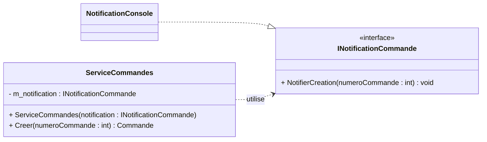

# E03 — Injecter manuellement une dépendance

## Mission et durée

En 60 minutes, rendez la notification substituable, assemblez les objets sans
conteneur et écrivez un test simple. Réalisez tout le travail dans `dev`.

Le départ compilable se trouve dans
`S03E03E04_Restaurant_Notification`. `ServiceCommandes` construit actuellement
sa notification console : le service choisit donc lui-même un détail concret.

## 1. Créer la branche de développement

Reprenez au besoin les explications de [E13](./E13-branches-git.md).

```bash
git switch main
git pull
git switch -c dev
git push -u origin dev
```

## 2. Rendre la dépendance visible

1. Créez `INotificationCommande` avec la méthode
   `NotifierCreation(int numeroCommande)`.
2. Faites implanter ce contrat par `NotificationConsole`.
3. Ajoutez un constructeur à `ServiceCommandes` et recevez le contrat.
4. Conservez la dépendance dans une variable d'objet privée `m_notification`.
5. Retirez toute création de `NotificationConsole` du service.
6. Dans `Program.cs`, construisez la notification, puis injectez-la dans le
   service avant de créer la commande `1001`.

Le constructeur doit refuser une notification `null`. Le conteneur .NET est
interdit dans E03 : l'objectif est de voir le mécanisme POO.



## 3. Écrire un test simple

Dans le projet de tests :

1. créez `NotificationCommandeMemoire`, qui enregistre le dernier numéro reçu;
2. injectez-la dans `ServiceCommandes`;
3. exécutez `Creer(1001)`;
4. auditez que le dernier numéro notifié vaut `1001`.

Respectez Arranger, Agir et Auditer. Ne résolvez jamais un service avec un
conteneur dans un test unitaire.

## 4. Tester et fusionner

```bash
dotnet test
git status
git add .
git commit -m "Injecte manuellement la notification de commande"
git push
git switch main
git merge dev
dotnet test
git push
```

Terminé lorsque le service ne construit plus sa dépendance, le test réussit sur
`dev` et sur `main`, et les deux branches sont publiées.
