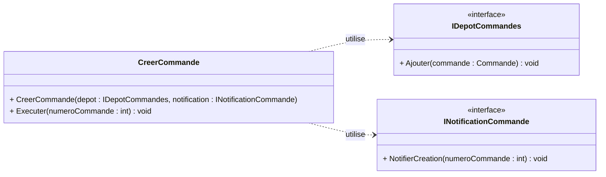

# EX01 — Injection, composition et branches

> [!IMPORTANT]
> **Évaluation individuelle — 2,5 %. Niveau 0 : zéro IA.** La génération de
> code, de tests ou de documentation par une IA est interdite.

## Mission et durée

Prévoyez de 90 à 100 minutes. Les contrats, le domaine et les implantations
concrètes sont fournis. Complétez le cas d'utilisation, son test, les deux
modes d'assemblage et le parcours Git demandé.

Le départ se trouve dans `S03EX01_Restaurant_Composition`.

## Parcours Git obligatoire

1. Créez et publiez `dev` depuis `main`.
2. Depuis `dev`, créez et publiez `fonctionnalite/ex01-injection`.
3. Effectuez le travail et au moins deux commits cohérents dans cette branche.
4. Fusionnez la fonctionnalité dans `dev`, exécutez les tests et publiez.
5. Fusionnez `dev` dans `main`, exécutez les tests et publiez.

Revoyez [E13](./E13-branches-git.md) pour les commandes. La qualité du parcours
Git fait partie des critères, mais aucune fusion conflictuelle n'est attendue.

## Travail demandé

1. Injectez `IDepotCommandes` et `INotificationCommande` dans le constructeur
   de `CreerCommande` et refusez les dépendances `null`.
2. Dans `Executer`, créez la commande, ajoutez-la au dépôt, puis envoyez la
   notification.
3. Écrivez un test qui injecte des doublures simples, puis vérifie la commande
   ajoutée et le numéro notifié.
4. Montrez d'abord l'assemblage manuel dans une méthode de `Program.cs`.
5. Dans une seconde méthode, utilisez `Host.CreateApplicationBuilder(args)`,
   `AddScoped`, `Build`, `CreateScope` et `GetRequiredService`.
6. Gardez le conteneur dans le projet Terminal et choisissez le mode avec
   l'argument `--manuel`; sans cet argument, utilisez le conteneur.
7. Complétez `DECISIONS.md` avec le cycle de vie choisi et la sortie de
   `git log --oneline --graph --decorate --all`.

## Critères observables

- Application ne dépend ni d'Infrastructure ni du conteneur;
- les deux dépendances sont explicites dans le constructeur;
- le test respecte Arranger, Agir et Auditer et n'utilise pas le conteneur;
- les assemblages manuel et automatisé créent la commande `1001`;
- les deux implantations `Scoped` sont réutilisées dans une même portée;
- `dev` et `main` contiennent la fonctionnalité testée;
- `DECISIONS.md` justifie les choix en quelques phrases.
