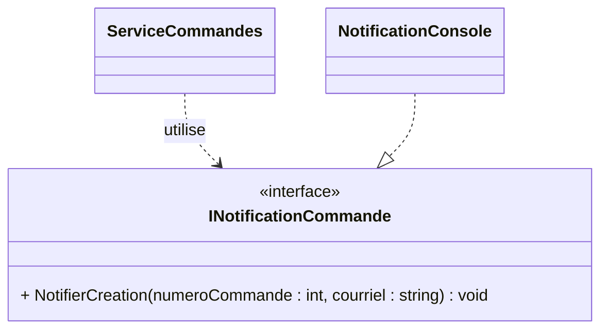

# Exercice 1

## Mission et durée

En 50 minutes, rendez la notification substituable. Le cas d'utilisation ne
doit plus construire ni connaître `NotificationConsole`.

## Parcours Git

Créez `dev` depuis `main`, puis créez et publiez
`fonctionnalite/notification-abstraite` depuis `dev`. Revoyez la fiche Git de
la semaine 3 pour les commandes.

## Travail demandé

1. Créez l'interface étroite `INotificationCommande`.
2. Faites implanter ce contrat par `NotificationConsole`.
3. Injectez le contrat dans le constructeur de `ServiceCommandes` et refusez
   une valeur `null`.
4. Assemblez les objets dans `Program.cs`.
5. Écrivez un simulacre manuel qui mémorise le dernier numéro notifié.
6. Écrivez **un seul test** : vérifiez que
   `Creer(1001, 40m, client)` retourne la commande et notifie `1001`.

La portée des tests est volontairement limitée à une méthode de test. Il n'est
pas nécessaire de tester `NotificationConsole`.

Fusionnez la fonctionnalité dans `dev`, exécutez `dotnet test`, puis fusionnez
`dev` dans `main` et publiez les deux branches.
